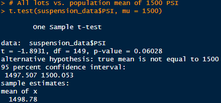

# MechaCar Statistical Analysis

## Linear Regression to Predict MPG
Linear regression was performed on a dataset of 50 samples to determine which features of vehicle length, vehicle weight, spoiler angle, ground clearance and AWD are the best predictors of the prototype's gas mileage (MPG).

The current linear regression model shows that vehicle length and ground clearance provide a non-random amount of variance in the prediction of the MPG for the prototypes along with the intercept; vehicle weight may have as well, but not to the significance level of at least 0.05 desired. The intercept being statistically significant indicates other factors are contributing to the MPG but are not accounted for in the model.

The p-value of 5.35x10^-11 indicates that the slope of the model is non-zero. The R^2 value of 0.71 means that the current model accurately predicts the data 71% of the time - the model is more accurate than not, but an inaccuracy of 29% means it still fails more than 1 out of 4 times.

## Summary Statistics on Suspension Coils

The second analysis concerns the weight capacities of the suspension coils used for the cars from 3 seperate manufacturing lots, a dataset of 150 obvservations across all 3 lots. Summary statistics including the mean, median, variance and standard deviation of the pounds per square inch (PSI) variable were computed first for all lots in total and then calculated grouped by each manufacturing lot.

The variance permitted by the design specifications cannot be more than 100 PSI, indicating that overall the weight capacities for the suspension coils is within specifications. However, viewing the data grouped by lot shows an issue:

Manufacturing Lot 3 shows that parts produced there are not within the parameters required by the design specifications; the low variance values in lots 1 and 2 counteract the effects of the large variance for Lot 3 for the the total data.

## T-Tests on Suspension Coils

The weight capacities of the suspension coils were analyzed with t-tests to determine if the mean was statistically different from the population mean of 1,500 PSI across all manufacturing lots and for each individual lot.

For all manufacturing lots combined the p-value of 0.06 lies above the significance level of 0.05, indicating that there isn't a statistical difference between the sample mean and the population mean.

| Manufacturing Lot | Results |
| :---: | :---: |
| Lot 1 |  |
| Lot 2 |  |
| Lot 3 |  |

For the individual lots, both Lot 1 and Lot 2 have p-values greater than 0.05 indicating that just like the mean of all 150 samples, their means aren't stastically different than the population mean. Lot 3 is an exception again, with a p-value of 0.04, making the mean different than the population mean at the current significance level.

## Study Design: MechaCar vs. Competition

As fuel efficiency is a common factor that is taken into consideration when buying a car, comparing the city fuel efficiency of the vehicle to the competition would be a great starting point. The data necessary for the study would be observations of the city fuel economy of MechaCar and a competitor vehicle.

For the statistical test, a two sample t-test where the null hypothesis is that the population means of MechaCar and the competitor's city fuel efficiency data are the same, and the alternative hypothesis is that they are statistically different. Since the interest is solely on MechaCar's performance vs. a competitor, even when comparing to multiple competitors multiple t-tests with MechaCar always as one of the sample groups is used over ANOVA. With ANOVA all groups are compared, including competitor vs. competitor, to determine the existence of a difference of means which doesn't specifically address if MechaCar's mean is different to the competitors.